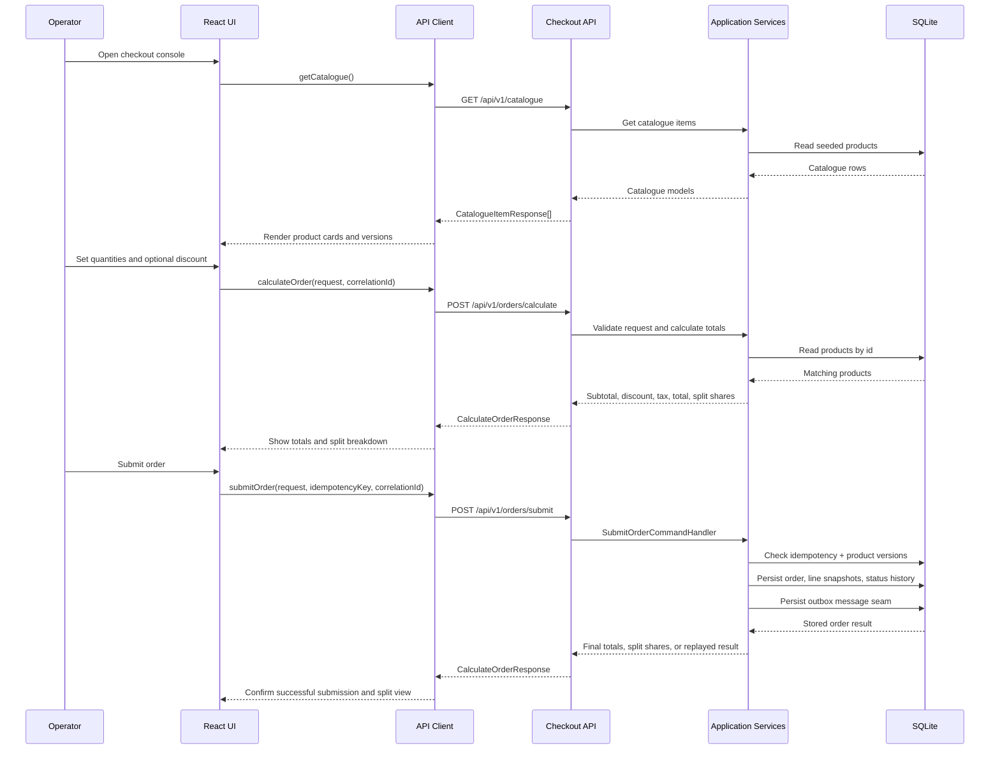
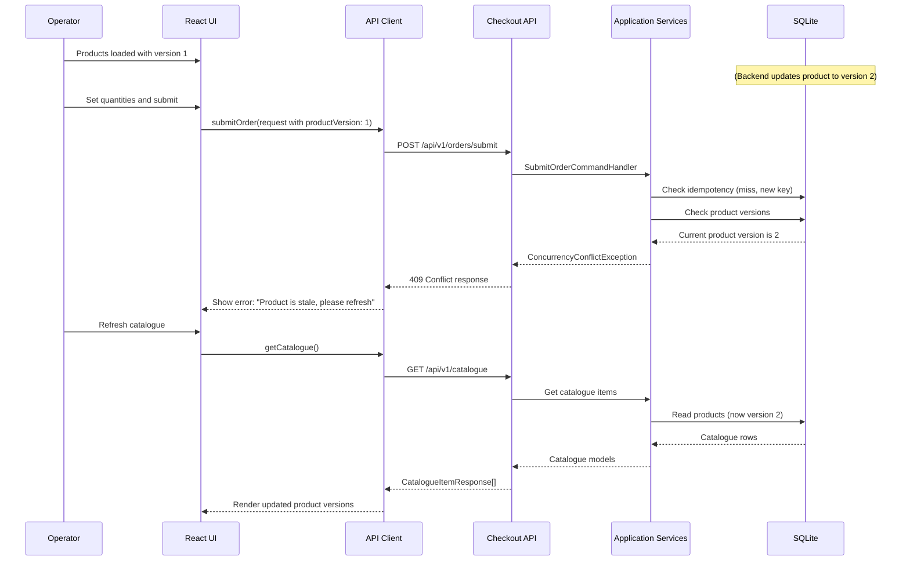
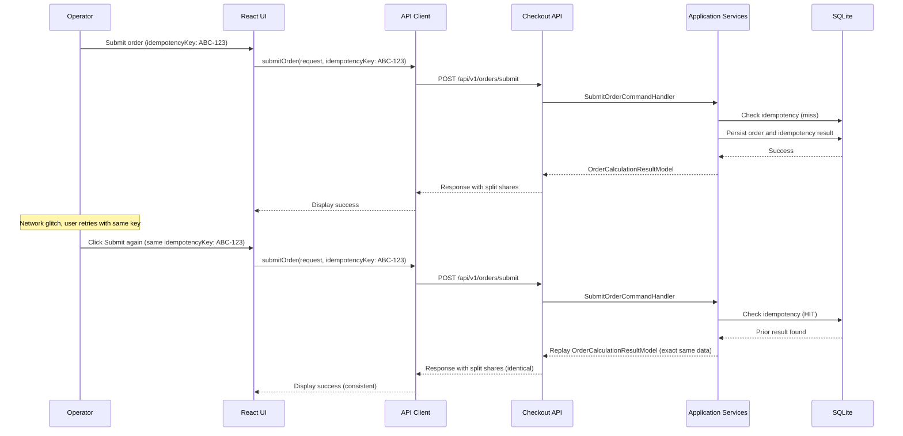

# Application Flow And Request/Response Examples

This wiki page captures the request/response flow between the React UI and the .NET backend, including sequence diagrams for each checkout phase.

## Architecture Overview

For detailed architecture information including layer responsibilities, class diagrams, and database schema, see [Backend Architecture And Data Model](backend-architecture-and-data-model.md).

The system follows a modular clean-architecture pattern with four projects:

- **Domain**: core business concepts (Product, DiscountType)
- **Application**: use-case orchestration and validation
- **Infrastructure**: persistence, repositories, event dispatch
- **API**: HTTP endpoints and composition

## Request/Response Flows

### Phase 1: Catalogue Discovery

**Request:**
```http
GET /api/v1/catalogue
```

**Response:**
```json
[
  {
    "id": "550e8400-e29b-41d4-a716-446655440000",
    "name": "Cold Sandwich",
    "unitPrice": 5.99,
    "isTaxable": false,
    "version": 1
  },
  {
    "id": "6ba7b810-9dad-11d1-80b4-00c04fd430c8",
    "name": "Hot Coffee",
    "unitPrice": 3.50,
    "isTaxable": true,
    "version": 1
  }
]
```

**Flow:**
1. React UI mounts and calls `getCatalogue()`
2. API Client calls `GET /api/v1/catalogue`
3. Catalogue endpoint calls `CheckoutService.GetCatalogueAsync()`
4. Service queries the Products table via repository
5. Products are mapped to `CatalogueItemModel` and returned as JSON
6. UI renders product cards with name, price, and taxability indicator

### Phase 2: Order Calculation (Preview)

**Request:**
```http
POST /api/v1/orders/calculate

{
  "lineItems": [
    {
      "productId": "550e8400-e29b-41d4-a716-446655440000",
      "quantity": 2
    },
    {
      "productId": "6ba7b810-9dad-11d1-80b4-00c04fd430c8",
      "quantity": 1
    }
  ],
  "discount": {
    "type": "Percentage",
    "value": 10.0
  }
}
```

**Response:**
```json
{
  "subtotal": 15.48,
  "discountApplied": 1.55,
  "tax": 2.79,
  "total": 16.72,
  "splitShares": [
    { "payerIndex": 0, "amount": 556 },
    { "payerIndex": 1, "amount": 558 },
    { "payerIndex": 2, "amount": 558 }
  ]
}
```

**Flow:**
1. User adjusts quantities and/or discount in the UI
2. React UI generates `OrderCalculationRequestModel`
3. API Client calls `POST /api/v1/orders/calculate` with request
4. Calculation endpoint calls `CheckoutService.CalculateOrderAsync()`
5. Service validates request using structured validator
6. Service reads product details from Products table
7. Service calculates: subtotal → discount → tax → total → split shares
8. All amounts are rounded per item using bankers rounding (ToEven)
9. Split shares are calculated as whole-number units with remainder to payer 1
10. Result is returned to UI and displayed without persisting

### Phase 3: Order Submission (Persisted)

**Request:**
```http
POST /api/v1/orders/submit
Idempotency-Key: 550e8400-e29b-41d4-a716-446655440001
X-Correlation-ID: 6ba7b810-9dad-11d1-80b4-00c04fd430c9

{
  "lineItems": [
    {
      "productId": "550e8400-e29b-41d4-a716-446655440000",
      "quantity": 2,
      "productVersion": 1
    },
    {
      "productId": "6ba7b810-9dad-11d1-80b4-00c04fd430c8",
      "quantity": 1,
      "productVersion": 1
    }
  ],
  "discount": {
    "type": "Percentage",
    "value": 10.0
  }
}
```

**Response (Success):**
```json
{
  "subtotal": 15.48,
  "discountApplied": 1.55,
  "tax": 2.79,
  "total": 16.72,
  "splitShares": [
    { "payerIndex": 0, "amount": 556 },
    { "payerIndex": 1, "amount": 558 },
    { "payerIndex": 2, "amount": 558 }
  ]
}
```

**Response (Concurrency Conflict):**
```json
{
  "type": "https://api.checkout-system.local/problems/concurrency-conflict",
  "title": "Concurrency Conflict",
  "status": 409,
  "detail": "Product 550e8400-e29b-41d4-a716-446655440000 is stale. Expected version 2, received 1.",
  "traceId": "6ba7b810-9dad-11d1-80b4-00c04fd430c9"
}
```

**Flow:**
1. User clicks Submit in the UI
2. UI generates a new UUID for `Idempotency-Key` and `X-Correlation-ID`
3. API Client calls `POST /api/v1/orders/submit` with headers and request
4. Correlation middleware extracts/validates `X-Correlation-ID` and enriches logging scope
5. Submit endpoint routes to `SubmitOrderCommandHandler`
6. Command handler checks idempotency:
   - If key + request hash match a prior record → replay prior result (idempotent)
   - If key matches but payload differs → return 400 Bad Request
   - If key is new → proceed to validation and submission
7. Command handler enforces optimistic concurrency:
   - For each line item, validate `productVersion` matches current database version
   - If mismatch detected → return 409 Conflict
8. If validation passes:
   - Begin transaction
   - Calculate totals (same logic as preview)
   - Persist immutable order snapshot to `Orders` table
   - Persist line-item details to `OrderLineSnapshots` table
   - Create initial status record in `OrderStatusHistory` (status: "Submitted")
   - Persist idempotency result to `IdempotencyRecords` table
   - Publish domain event to `OutboxMessages` for later processing
   - Commit transaction
9. Return final totals and split shares
10. UI displays order summary with split breakdown

## Sequence Diagrams

### Catalogue Load and Order Workflow



### Concurrency Conflict Handling



### Idempotent Submission Retry



## Notes

- All monetary values are in GBP.
- Tax rate is fixed at 20% for taxable items only.
- Discounts are applied before tax.
- All amounts are rounded per item to 2 decimal places using bankers rounding (round half to even).
- Split shares are whole-number units (pence); any rounding remainder is assigned to payer 1.
- Idempotency key uniqueness and request hash validation ensure safe retry semantics.
- Product version metadata enables optimistic concurrency and 409 conflict detection.
- Correlation ID propagates through the request lifecycle for tracing and structured logging.