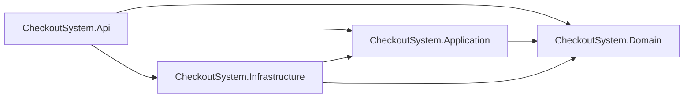
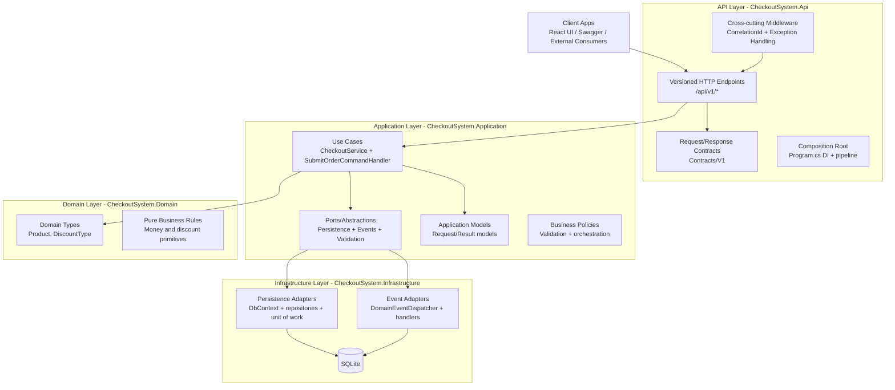
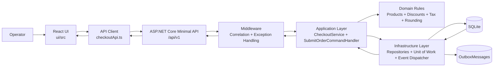
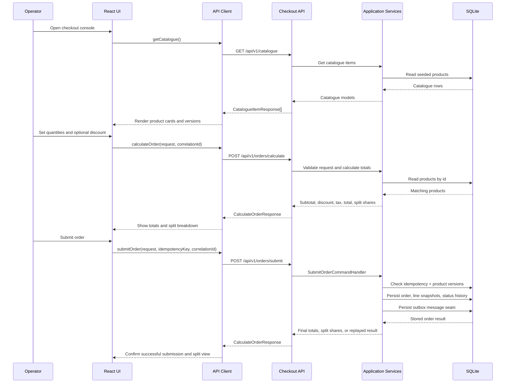

# Application Architecture And Flow

This wiki page captures the current Part One and Part Two architecture and the end-to-end request flow between the React UI and the .NET backend.

## API Project Dependency Graph

### Dependency Intent

- `CheckoutSystem.Domain`: core business concepts that should stay framework-agnostic and stable.
- `CheckoutSystem.Application`: use-case orchestration, validation, and business workflows that depend on domain types, not storage or transport details.
- `CheckoutSystem.Infrastructure`: technical implementations (EF Core, SQLite, repository implementations, event dispatch handlers) that fulfill application abstractions.
- `CheckoutSystem.Api`: transport layer and composition root (endpoint mapping, contracts, middleware, DI wiring) that references the other projects to expose HTTP behavior.
- `CheckoutSystem.Api -> CheckoutSystem.Domain` is acceptable in this proof-of-concept because endpoint contract mapping uses `DiscountType`; for stricter layering, map to an application enum/DTO and remove this reference.

## Layered Block Diagram (What Goes Where)

### Layer Placement Rules And Why

- API layer:
    Handles HTTP-only concerns (routing, versioning, headers, status codes, OpenAPI, middleware) so transport changes do not ripple into business logic.
- Application layer:
    Owns use-case flow (calculate, submit), validation, idempotency workflow orchestration, and transaction boundaries via abstractions so the business process is testable and independent of infrastructure details.
- Domain layer:
    Holds core concepts and invariant-friendly types (`Product`, `DiscountType`) so critical business meaning remains independent from frameworks and I/O.
- Infrastructure layer:
    Implements technical concerns (EF Core, SQLite, repository classes, event handlers, migrations) so persistence/event technology can evolve without rewriting use-case logic.
- Dependency rule:
    Dependencies should point inward toward stable business policy (`Api/Infrastructure -> Application -> Domain`), with outward details implemented through interfaces from the application layer.

## Architecture Diagram

## Application Flow

## Notes

- The UI targets `http://localhost:5152/api/v1` by default and can be overridden with `VITE_API_BASE_URL`.
- Request payloads use string enum values for discount type, matching both the UI client and Swagger examples.
- Submit requests must include `Idempotency-Key`; the backend replays the prior result when the same key and payload are retried.
- Optimistic concurrency is enforced through `productVersion` on each selected line item.
- Split-payment output currently returns exactly 3 whole-number shares (no cents), with any remainder whole unit assigned to payer 1.