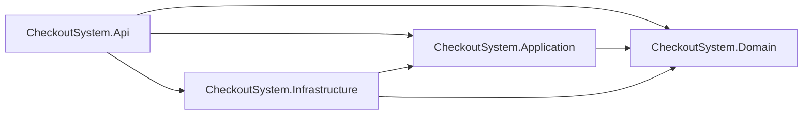
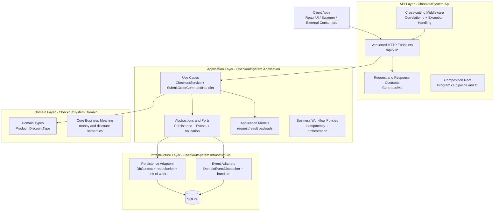
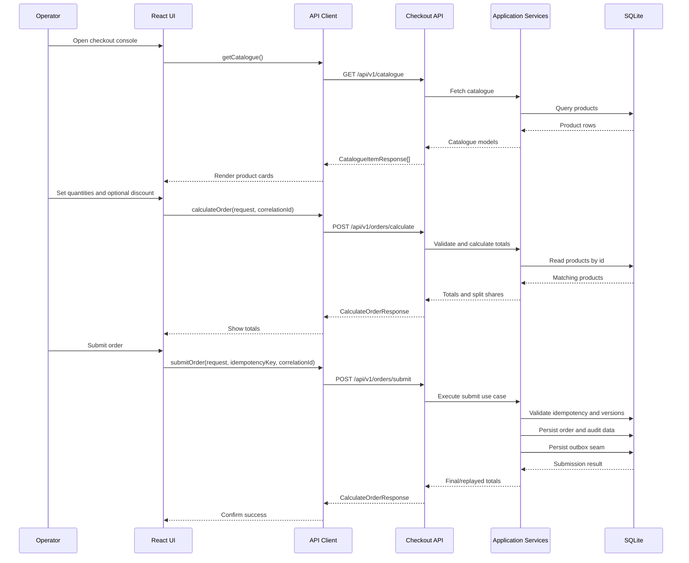
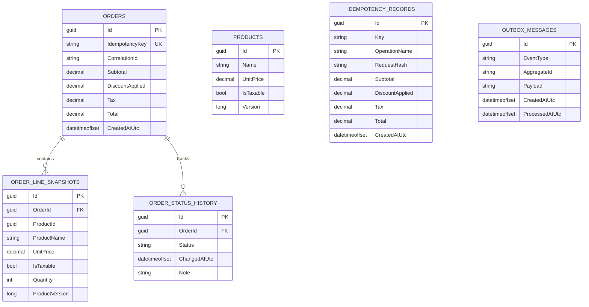

# Backend Architecture And Data Model

This page documents backend project dependencies, layer responsibilities, request flow, and the SQLite schema for the checkout proof of concept.

## 1. API Project Dependency Graph

### Why This Dependency Shape Exists

- Domain: stable business concepts and primitives that remain framework-agnostic.
- Application: use-case orchestration and policies that depend on domain types and abstractions.
- Infrastructure: technical adapters that implement application abstractions for persistence and event handling.
- API: transport and composition root concerns that wire up application and infrastructure for HTTP.
- Current POC exception: API references Domain to map discount enum values; a stricter clean layering variant would move this mapping to application contracts and remove Api -> Domain.

## 2. Layered Block Diagram (What Goes In Which Layer)

### Placement Rules

- API layer owns HTTP concerns only (routing, headers, status codes, middleware, OpenAPI).
- Application layer owns use-case sequencing, validation, and business workflow orchestration.
- Domain layer owns core business concepts and invariant-friendly types.
- Infrastructure layer owns technical implementation details and external I/O.
- Dependency direction stays inward: Api and Infrastructure depend on Application, and Application depends on Domain.

## 3. End-To-End Request Flow

## 4. Database Table Relationship Diagram

### Relationship Notes

- Orders to OrderLineSnapshots is one-to-many with cascade delete.
- Orders to OrderStatusHistory is one-to-many with cascade delete.
- OrderLineSnapshots.ProductId is intentionally stored as a snapshot value and does not enforce a foreign key to Products.
- OutboxMessages is independent from Orders to support eventual integration publishing boundaries.
- IdempotencyRecords is independent from Orders and stores replay payload totals for idempotent submission behavior.

## 5. Database Schema Details

### Products

Purpose: source-of-truth catalogue rows used for pricing and taxability.

| Column | Type (SQLite/EF) | Null | Constraints |
| --- | --- | --- | --- |
| Id | TEXT (Guid) | No | PK |
| Name | TEXT | No | MaxLength(200) |
| UnitPrice | TEXT (decimal 18,2) | No | Precision(18,2) |
| IsTaxable | INTEGER (bool) | No | - |
| Version | INTEGER (long) | No | Concurrency token, default 1 |

Indexes:

- PK_Products on Id.

### IdempotencyRecords

Purpose: stores request-hash keyed response totals for safe replay on retries.

| Column | Type (SQLite/EF) | Null | Constraints |
| --- | --- | --- | --- |
| Id | TEXT (Guid) | No | PK |
| Key | TEXT | No | MaxLength(200) |
| OperationName | TEXT | No | MaxLength(100) |
| RequestHash | TEXT | No | MaxLength(128) |
| Subtotal | TEXT (decimal 18,2) | No | Precision(18,2) |
| DiscountApplied | TEXT (decimal 18,2) | No | Precision(18,2) |
| Tax | TEXT (decimal 18,2) | No | Precision(18,2) |
| Total | TEXT (decimal 18,2) | No | Precision(18,2) |
| CreatedAtUtc | TEXT (DateTimeOffset) | No | - |

Indexes:

- Unique IX_IdempotencyRecords_Key_OperationName on (Key, OperationName).

### Orders

Purpose: immutable financial snapshot per successful submission.

| Column | Type (SQLite/EF) | Null | Constraints |
| --- | --- | --- | --- |
| Id | TEXT (Guid) | No | PK |
| IdempotencyKey | TEXT | No | MaxLength(200), Unique |
| CorrelationId | TEXT | No | MaxLength(100) |
| Subtotal | TEXT (decimal 18,2) | No | Precision(18,2) |
| DiscountApplied | TEXT (decimal 18,2) | No | Precision(18,2) |
| Tax | TEXT (decimal 18,2) | No | Precision(18,2) |
| Total | TEXT (decimal 18,2) | No | Precision(18,2) |
| CreatedAtUtc | TEXT (DateTimeOffset) | No | - |

Indexes:

- Unique IX_Orders_IdempotencyKey on IdempotencyKey.

Relationships:

- One order has many line snapshots.
- One order has many status history records.

### OrderLineSnapshots

Purpose: immutable ordered-line detail captured at submit time.

| Column | Type (SQLite/EF) | Null | Constraints |
| --- | --- | --- | --- |
| Id | TEXT (Guid) | No | PK |
| OrderId | TEXT (Guid) | No | FK -> Orders.Id |
| ProductId | TEXT (Guid) | No | Snapshot identifier |
| ProductName | TEXT | No | MaxLength(200) |
| UnitPrice | TEXT (decimal 18,2) | No | Precision(18,2) |
| IsTaxable | INTEGER (bool) | No | - |
| Quantity | INTEGER | No | - |
| ProductVersion | INTEGER (long) | No | - |

Indexes:

- IX_OrderLineSnapshots_OrderId on OrderId.

Relationships:

- Many snapshots belong to one order via FK with cascade delete.

### OrderStatusHistory

Purpose: append-only status transitions for order lifecycle auditability.

| Column | Type (SQLite/EF) | Null | Constraints |
| --- | --- | --- | --- |
| Id | TEXT (Guid) | No | PK |
| OrderId | TEXT (Guid) | No | FK -> Orders.Id |
| Status | TEXT | No | MaxLength(100) |
| ChangedAtUtc | TEXT (DateTimeOffset) | No | - |
| Note | TEXT | No | MaxLength(500) |

Indexes:

- IX_OrderStatusHistory_OrderId on OrderId.

Relationships:

- Many history records belong to one order via FK with cascade delete.

### OutboxMessages

Purpose: integration-event staging for asynchronous publish processing.

| Column | Type (SQLite/EF) | Null | Constraints |
| --- | --- | --- | --- |
| Id | TEXT (Guid) | No | PK |
| EventType | TEXT | No | MaxLength(200) |
| AggregateId | TEXT | No | MaxLength(100) |
| Payload | TEXT | No | JSON payload |
| CreatedAtUtc | TEXT (DateTimeOffset) | No | - |
| ProcessedAtUtc | TEXT (DateTimeOffset) | Yes | Nullable processing marker |

Indexes:

- IX_OutboxMessages_ProcessedAtUtc on ProcessedAtUtc.

## 6. Operational Notes

- API base path remains /api/v1.
- UI default target remains http://localhost:5152/api/v1, overridable via VITE_API_BASE_URL.
- Submit requests require Idempotency-Key.
- Optimistic concurrency on products is enforced with Version.
- Split payment output currently returns exactly three whole-number shares (no cents), with remainder whole unit assigned to payer 1.