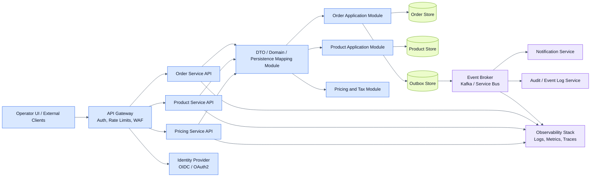
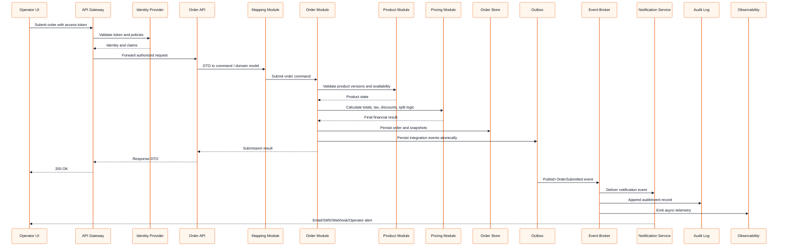

# Enterprise Improvement Plan

This page describes what would need to change if the current proof of concept evolved into a real enterprise-grade order and product management platform.

## Current Scope Summary

The current solution intentionally prioritizes a thin, assessable vertical slice:

- Versioned checkout API for catalogue read, order calculation, and idempotent submit.
- SQLite persistence with minimal order, idempotency, outbox, snapshot, and status-history support.
- React operator UI for catalogue selection, totals, and fixed three-way whole-number split display.
- Core seams for correlation IDs, optimistic concurrency, idempotency, domain events, and audit snapshots.

This is enough for the assessment, but it is not yet a production-grade commerce platform.

## What Is Still Missing

### Platform And Service Boundaries

- Separate product management, order management, pricing, inventory, and notification concerns into independently deployable modules or services.
- Introduce a proper DTO-to-domain and domain-to-persistence mapping module so transport, domain, and storage models do not drift together over time.
- Replace direct endpoint composition of request models with dedicated mappers or assembler classes.
- Add explicit anti-corruption boundaries for any external catalogue, pricing, ERP, CRM, or payment integrations.

### Security And Identity

- Add authentication using OAuth 2.1 and OpenID Connect through a trusted identity provider.
- Add authorization with role- and policy-based access control for operators, customer-service staff, admin users, and machine identities.
- Enforce service-to-service authentication with managed identities, client credentials, or mutual TLS.
- Move secrets, keys, and connection strings into a managed secret store.
- Add data classification, encryption at rest, encryption in transit, and key-rotation procedures.

### Resilience And Traffic Protection

- Add per-endpoint rate limiting, client quotas, and abuse protection.
- Add retry, timeout, circuit-breaker, and fallback policies for external dependencies.
- Add backpressure handling for asynchronous consumers and downstream outage scenarios.
- Add dead-letter queues, poison-message handling, replay tooling, and operator runbooks.
- Add zero-downtime deployment and schema migration strategy.

### Event-Driven Architecture

- Promote the current domain-event seam into a full outbox-to-broker pipeline.
- Publish durable integration events for order lifecycle actions such as `OrderSubmitted`, `OrderStatusChanged`, `ProductUpdated`, and `InventoryReserved`.
- Add asynchronous consumers for notifications, reporting, audit streaming, analytics, and downstream fulfillment.
- Define versioned event contracts and consumer compatibility strategy.
- Add idempotent consumer handling and ordered-processing rules where needed.

### Observability And Operations

- Emit structured logs with stable event names and semantic fields across all services.
- Add distributed tracing using OpenTelemetry across HTTP, messaging, and storage operations.
- Add dashboards for order throughput, calculation latency, retry rates, failed submissions, and stale-product conflicts.
- Add alerts for broker lag, outbox backlog, error-rate spikes, auth failures, and unexpected replay volume.
- Add health checks, readiness checks, synthetic transactions, and service-level objectives.

### Auditability And History

- Expand the current order status history into a formal immutable audit log.
- Record who performed each change, from where, when, and under which correlation and causation IDs.
- Persist before-and-after change records for mutable product and order operations.
- Add an append-only event log or event store for operational replay and forensic reconstruction.
- Add retention, archival, and compliance policies for financial and audit records.

### Notifications And User Communication

- Add a notification service that consumes order lifecycle events.
- Support email, SMS, webhooks, and internal operator notifications through channel-specific adapters.
- Add notification templates, delivery tracking, retry rules, and failure escalation.
- Track notification history as part of the audit story.

## Why These Were Excluded For Now

These concerns were intentionally deferred because the assessment was time-boxed and optimized for demonstrating architectural judgment through seams rather than completing a full enterprise platform.

- A full service decomposition would have slowed delivery before the core business flow was proven.
- Auth, policy enforcement, and token flows add significant configuration and operational setup that were not required to demonstrate the checkout domain slice.
- Full event-broker integration, retries, notifications, and dead-letter operations would introduce infrastructure complexity well beyond the proof-of-concept goal.
- Deep observability and audit infrastructure are important, but the assessment primarily required clear extension points, not a full production control plane.
- Dedicated mapper modules were postponed until there was enough model surface area to justify the extra ceremony.

## Target Enterprise Architecture

## Enterprise Order Flow

## Improvement Areas By Capability

### API And Application Design

- Introduce a dedicated mapping layer or module for DTO-to-command, DTO-to-domain, domain-to-event, and persistence-model conversions.
- Move endpoint request assembly logic into mapper classes to keep endpoint code declarative.
- Add explicit module contracts between order, product, pricing, inventory, and notifications.
- Add formal command and query separation where read and write scaling concerns diverge.

### Security Improvements

- Require authenticated access tokens for all product and order operations.
- Apply fine-grained authorization policies, for example `orders.submit`, `orders.read`, `products.write`, and `audit.read`.
- Add request signing or webhook signature validation for external callbacks.
- Add tamper-resistant audit logs and privileged-action monitoring.

### Observability Improvements

- Standardize correlation ID, causation ID, tenant ID, actor ID, and request ID across logs and events.
- Instrument calculation latency, submit latency, outbox lag, notification success rate, and stale-write conflict rate.
- Use trace propagation across gateway, API, broker, consumers, and storage.

### Resilience Improvements

- Apply retries only to safe transient failures and keep submit writes idempotent.
- Use circuit breakers around slow or failing downstream services.
- Add bulkheads for notification and reporting consumers so they do not impact checkout writes.
- Add rate limits by client, route, and auth scope.

### Data And Audit Improvements

- Separate immutable financial snapshots from mutable operational views.
- Store an append-only event log for key business transitions.
- Add product change history, who changed it, and approval trails where required.
- Add retention rules and export capability for compliance investigations.

### Notification Improvements

- Trigger confirmation, failure, and operational alerts from events rather than synchronous controller logic.
- Support notification preferences, retries, templates, localization, and escalation.
- Add reconciliation views for undelivered notifications.

## Suggested Delivery Roadmap

1. Add authentication, authorization, rate limiting, health checks, and CI quality gates.
2. Introduce dedicated mapping modules and tighten service/module contracts.
3. Replace in-process domain-event dispatch with outbox publishing to a real broker.
4. Add notification consumers, audit/event-log consumers, and operational dashboards.
5. Expand product and order management into richer workflows with approvals, search, and reporting.

## Recommendation

Keep the current solution as the proof-of-concept baseline, but treat it as the core domain slice inside a larger event-driven platform. The next enterprise step is not to rewrite the business logic, but to harden its boundaries: identity, mapping, telemetry, messaging, resilience, and audit depth.